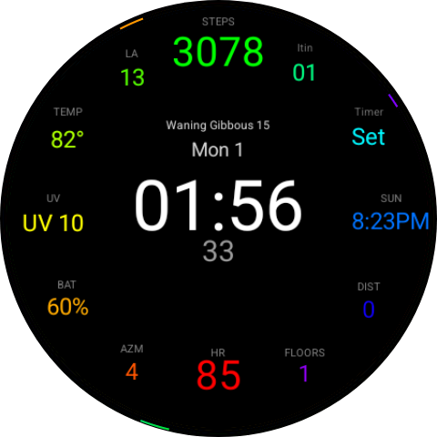

# Data 9 — a data-rich Wear OS watch face

A digital watch face for Wear OS (built & tested on **Pixel Watch 4 / Wear OS 6**),
written in the declarative [Watch Face Format (WFF)](https://developer.android.com/training/wearables/wff)
— **no compiled code**.



## Features

- Large digital time with seconds and a centered date.
- **Moon phase** name + day-of-cycle, from the built-in `MOON_PHASE_*` sources.
- **Three rainbow dot indicators** sweeping the rim — hours, minutes, seconds —
  each revealing a static ROYGBIV ring through a rotating mask, so the dot's
  colour changes with its position.
- **Los Angeles hour** (24h, DST-aware) via a timezone-localized `DigitalClock`.
- Built-in data (no provider needed): heart rate, battery, steps, step goal %.
- **8 complication slots** (the WFF maximum) around the dial for floors, AZM,
  temperature, UV, sunrise/sunset, distance, and two spare slots — each with a
  sensible default provider, editable on-watch.
- Dimmed, burn-in-safe always-on (ambient) mode.

## Build (no Gradle)

WFF watch faces contain no code, so the build is just
`aapt2 → zipalign → apksigner`. A PowerShell script wraps it:

```powershell
.\build.ps1            # validates XML, builds build\datawatch.apk
.\build.ps1 -Install   # also installs to a connected device
```

Requirements:
- Android SDK with `build-tools;34.0.0` and `platforms;android-34`
- A JDK (the script finds `keytool` via Android Studio's bundled JBR)
- A debug keystore is auto-created on first build (git-ignored).

### Validating the XML

The build runs Google's official WFF validator first. To fetch it:

```
libs/wff-validator.jar   # from https://github.com/google/watchface/releases
```

## Run on the Wear OS emulator

```powershell
.\run-emulator.ps1            # create AVD, boot, install, activate
.\run-emulator.ps1 -OnlyInstall   # reuse a running emulator
```

## Project layout

| Path | What |
|------|------|
| `res/raw/watchface.xml` | the watch face (the interesting file) |
| `res/xml/watch_face_info.xml` | preview + editor metadata |
| `res/values/strings.xml` | face name + complication slot labels |
| `res/drawable/preview.png` | store/editor preview image |
| `AndroidManifest.xml` | declares WFF v2, `hasCode=false` |
| `build.ps1` / `run-emulator.ps1` | build & emulator helpers |

## Notes / gotchas learned

- Built-in `WEATHER.*` tokens are schema-valid but did **not** render on the
  test Pixel Watch 4 — temperature/UV use complications instead.
- `DefaultProviderPolicy` changes only take effect on a **clean install**
  (`adb uninstall` then `install`), not an `install -r` upgrade.
- Animated indicators rotate the `PartDraw` (pivot 0.5,0.5) via a `[SECOND]`-style
  expression; a counter-rotating gradient works in the emulator but renders
  static on-device, so colour-by-position uses a static ring + rotating mask.

## License

[MIT](LICENSE)
